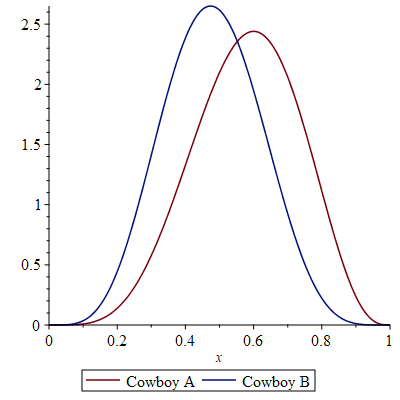
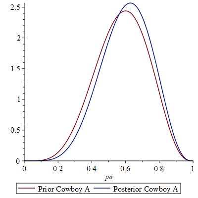

# Case Study: Duelling Cowboys
## Model
Consider two cowboys taking turns shooting at each other, one at a time.
In a bayesian manner, we express the prior belief about the hit probabilities of each cowboys by a prior distribution and condition it on the observed outcome(s).

Assume that for Cowboy A, we initially belief that the most likely hit probability is 0.6 with some uncertainity, which can be modelled by a ``Beta(5.5, 4)`` prior.
Conversely, for Cowboy B, we assume a prior ``Beta(5.5, 6)``, which models the belief that Cowboy B does not hit as often. 
The following plot illustrates the prior distributions.




As a probabilistic program, this may be modelled as:
```
pa ~ Beta(5.5, 4)
pb ~ Beta(5.5, 6)
turn, ahit, bhit = 0, 0, 0

while(ahit == 0 && bhit == 0) {
    if(turn == 0)
        ahit = Bernoulli(pa)
    else
        bhit = Bernoulli(pb)
    
    turn = 1 - turn
}

observe(data) // update prior according to data
return pa, pb // return posterior
```

## Blizzard to the Rescue

Existing, exact tools such as PSI are not able to analyze these kind of programs, as this program features an unbounded while-loop.

However, we can extract the inner loop and leave the hit propabilities as parameters. 
This can be encoded in a Blizzard source file (``duelling-cowboys.pp``).

To analyze the program, we launch the Docker image by fetching the blizzard image ``jmuellner/blizzrd`` and run it: ``docker run --rm -it jmuellner/blizzard``.

Next, we launch blizzard ``python3 blizzard.py case-studies/duelling-cowboys/duelling-cowboys.pp --analyze ahit bhit --style property`` and analyze the variables ``ahit`` and ``bhit`` after termination, using the ``property`` flag, which is necessary for parametric models.

```
root@76b58d5b900d:/opt/blizzard# python3 blizzard.py case-studies/duelling-cowboys/duelling-cowboys.pp --analyze ahit bhit --style property
Resulting program has 12 states
Storm: Time for model input parsing: 0.027s.

Storm: Time for model construction: 0.083s.

Storm: Time for model checking: 0.002s.

Storm: Time for model checking: 0.006s.

Storm: Time for model checking: 0.001s.

(bhit: 0, ahit: 1): (-1 * (pa))/(pa*pb+(-1)*pb+(-1)*pa)
(bhit: 1, ahit: 0): (pa*pb+(-1)*pb)/(pa*pb+(-1)*pb+(-1)*pa)
Elapsed time: 0.5329818725585938 s
```
We hence obtain the possible outcomes 
$$\mathbb{P}(ahit = 1) = \frac{pa}{pa+pb-pa*pb}$$
$$\mathbb{P}(bhit = 1) = \frac{pb-pa*pb}{pa+pb-pa*pb}$$

This lets us simplify the program considerably, as we can replace the inner loop by a simple assignment.
```
pa ~ Beta(5.5, 4)
pb ~ Beta(5.5, 6)

prob = pa / (pa + pb - pa * pb)
ahit = Bernoulli(prob)
bhit = 1 - ahit

observe(data) // update prior according to data
return pa, pb // return posterior
```

This program can be analyzed by the exact inference engine PSI.

## Analysis using PSI
Unfortunately, PSI segfaults on the above program. 
Even for ``Uniform(0,1)`` priors, the engine returns unevaluated integrals that are not useful at all.
It seems that the unhandy expressions that pop up in the computations are beyond symbolic capabilities of todays tools.

## Analysis using Maple
When using Maple, we can directly apply Bayes rule.

We assume that the hitting probabilities are independent, hence the joint prior  $\mathbb{P}(pa, pb) = pdf(pa) * pdf(pb)$.

The likelihood that cowboy A wins is given by $\mathbb{P}(ahit | pa, pb)$ and by the previous result is equal to $\mathbb{P}(ahit | pa, pb) = \frac{pa}{pa+pb-pa*pb}$.

Then Bayes' rule allows us to compute the (joint) posterior:
$$\mathbb{P}(pa, pb | ahit = 1) = \frac{\mathbb{P}(ahit | pa, pb) * \mathbb{P}(pa, pb)}{\mathbb{P}(ahit)} = \frac{\mathbb{P}(ahit | pa, pb) * \mathbb{P}(pa, pb)}{\int\mathbb{P}(ahit | pa, pb) * \mathbb{P}(pa, pb) \ dpa \ dpb}$$

By marginalizing ``pb`` out in the resulting joint posterior, we can obtain the posterior $\mathbb{P}(pa | ahit = 1)$.
As Maple solves the integrals numerically, the resulting function is only obtain numerically (although I believe it should be ``Beta``, due to conjugacy).

As we can see, after observing a win by cowboy A, our belief in her accuracy increases.
This process could be repeated for further observations.



NOTE: In the Maple worksheet doing this, we have to use numerical integration, as the default integration approach displays artifacts in the result.

## TODO
It would be interesting to throw a MCMC sampler at the problem (Stan, PyMC) and see what it can do. But what is the point of the first analysis if we resort to approximations anyway? Maybe use AQUA? No further investigation due to lack of time for now.

As in the other example, it would be interesting to impose more observations, which can be easily done in Maple. Also, it would be nice to use MCMC and see if Blizzard improves MC convergence for those examples.