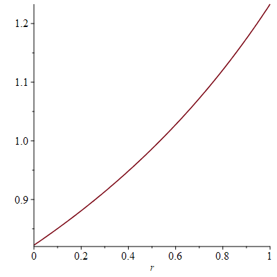

# Case Study: Proof-of-concept
## Model
Consider the following (imaginary) example of a continuous process that has a discrete influence.

Note: The program is quite simplistic,  otherwise PSI gives up quickly, especially when increasing the bound for `s` or when observing more data.
If looking for a more demanding benchmark, change the inequality for `s` in the loop guard and/or the upper bound of the `DiscreteUniform` in the loop body. 
Blizzard does not seem to be the bottleneck there and happily deliver results.

```
p ~ Uniform(0,1)

s, f = 0, 1
while s < 1 && f == 1 {
    f = Bernoulli(p)
    s = s + DiscreteUniform(0,2)
}

x = uniform(0, s) // pick value in [0, s]

observe(data) // update prior according to data
return p // return posterior
```

## Blizzard 

As with the duelling cowboys, existing (exact) tools cannot handle this program, neither does blizzard.
However, we can use Blizzard to extract the distribution $\mathbb{P}(s)$:

$$\mathbb{P}(s = 0) = \frac{p-1}{p-3}$$
$$\mathbb{P}(s = 1) = \frac{-1}{p-3}$$
$$\mathbb{P}(s = 2) = \frac{-1}{p-3}$$

We hence arrive at the following PSI program
```
def main(){
    r := uniform(0,1);
    
    p0 := (r-1)/(r-3);
    p1 := -1/(r-3);
    p2 := -1/(r-3);
    
    s := categorical([p0,p1,p2]);
    x := uniform(0,s);
    cobserve(x, data);
    
    return r;
}
```

Note: We have to use `cobserve` for observations over continuous disitributions in PSI.

## Analysis using PSI
When running this program using PSI, and using $data = 1.48$, we obtain:
$$p(r) = -{\frac { \left( 1-{\it Heaviside} \left( -1+r \right)  \right) {\it Heaviside} \left(  \left( -3+r \right) ^{-1}+1/2 \right) {\it  Heaviside} \left( r \right) }{-3\,\ln  \left( 6 \right) -2\,\ln \left( 2 \right) r+6\,\ln  \left( 2 \right) +\ln  \left( 6 \right) r} } $$

We can clearly see, that the posterior distribution of $r$ is tilted towards the right, i.e., higher values of $r$ are more probable based on the data.  



## Next Steps
In principle, nothing stops us from observing more evidence (*there is a script in the folder that simulates the random process, can be used to generate 'evidence'*). 
However PSI quickly refuses to work and/or return unevaluated integrals.

It would be feasible to model this is a CAS, say Maple, and apply Bayes' rule for each observation.
In addition, it would be interesting to compare the results to a MCMC samples (say PyMC or Stan) and compare the following approaches in speed and accuracy:

- Vanilla MCMC
- Blizzard + MCMC
- Blizzard + PSI
- maybe AQUA 